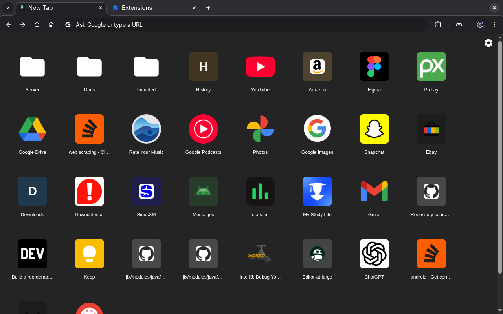
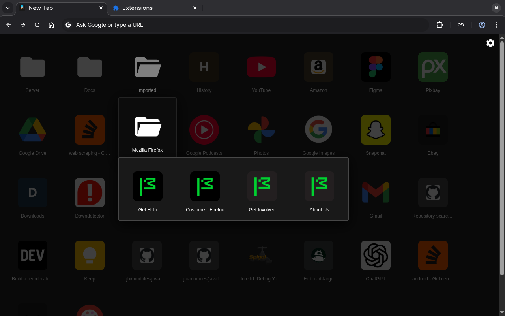
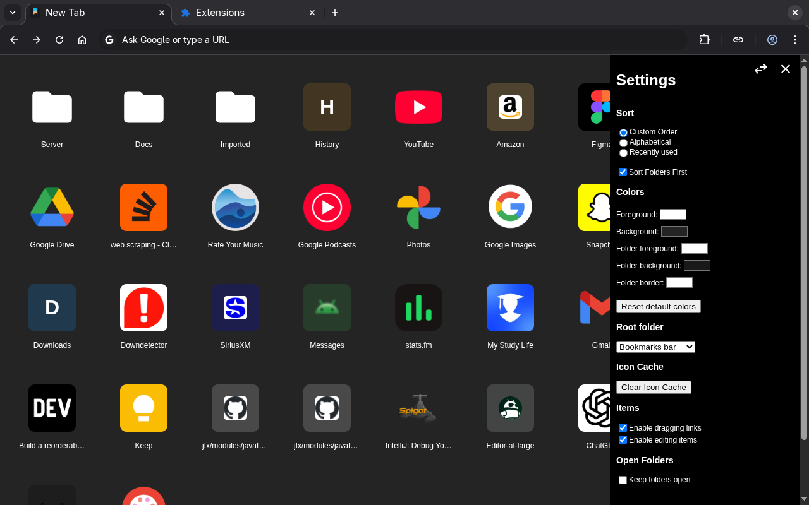
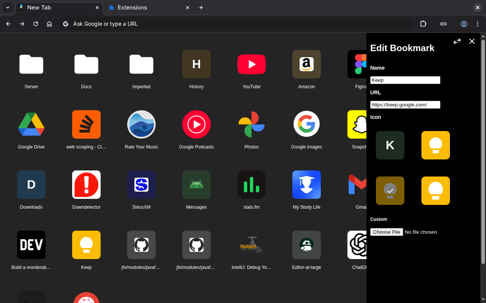

# Bookmarks Home
"beyond the bar"

### Features
- Automatically grabs high quality icons as sites are visited
- Built in editor with drag and drop to move
- Customizable colors
- Configurable root folder and sort order
- Open source

### Screenshots





### Links
[Chrome web store](https://chromewebstore.google.com/detail/bookmarks-home/bfehoohfhipooldjdipdbfeneacgchhm)

[Firefox Add-ons](https://addons.mozilla.org/en-US/firefox/addon/bookmarks-home)

### Building
1. Install libraries
```
npm install
```
2. Generate unpacked extension in `dist/`
```
npm run build
```
